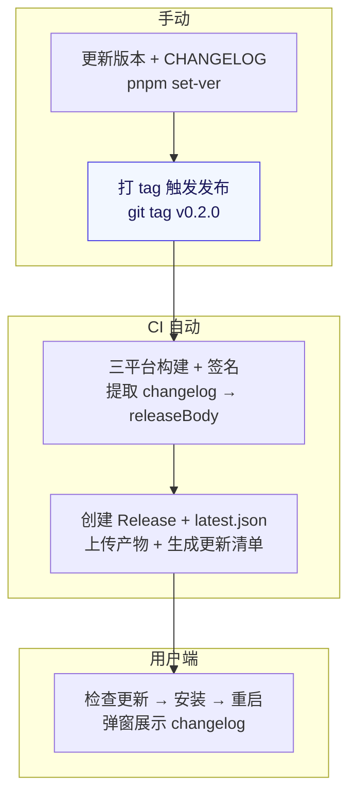

# 发布流程

SeraphineMusic 从代码到用户收到更新的完整链路。

## 阶段说明

- **手动**：`pnpm set-ver` 统一版本号，更新 CHANGELOG.md，打 tag（`v` 前缀）触发 CI。
- **CI 自动**：三平台矩阵构建并签名，从 CHANGELOG 提取对应版本段作为 Release body，生成 `latest.json`。
- **用户端**：应用检查 `latest.json` 对比版本，有新版则弹窗展示 changelog，下载校验签名后安装并重启。
